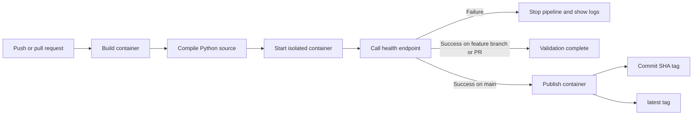

# DentalFlow CI/CD Pipeline

## Purpose

This pipeline validates every code change and publishes a container artifact after a successful merge to `main`. It does not deploy to Amazon ECS or change any live AWS resource.

## Pipeline flow


## Trigger behavior

| Event | Validate container | Publish container |
|---|---:|---:|
| Push to a feature branch | Yes | No |
| Pull request targeting `main` | Yes | No |
| Push or merge to `main` | Yes | Yes |
## Quality gates

1. The Docker image must build from `backend/Dockerfile`.
2. Python must compile every source file under `/app/app`.
3. The container must start with CI-only configuration.
4. `GET /health` must return `{"status":"ok"}`.
5. The publish job cannot run unless validation succeeds.
## Runtime isolation

DentalFlow normally starts an SQS consumer during application startup. The application now starts that consumer only when `UPLOAD_QUEUE_URL` has a value. The deployed ECS task supplies the queue URL, so its behavior is preserved. The CI smoke test leaves the queue URL empty, which prevents the test from contacting SQS.

The workflow supplies dummy values for `DATABASE_URL`, `JWT_SECRET`, `AWS_ACCESS_KEY_ID`, and `AWS_SECRET_ACCESS_KEY`. They exist only inside the temporary smoke-test container. They are not production credentials and are not stored as GitHub secrets.
## Artifact naming

The package is published at `ghcr.io/keusuanl/dentalflow` with two tags:

- The full Git commit SHA provides an immutable link from source commit to image.
- `latest` points to the most recent successful `main` build.

No image is published from a pull request or feature-branch push.
## Repository layout

```text
Secure_CICD/
├── .github/
│   └── workflows/
│       └── ci.yml
├── backend/
│   ├── .dockerignore
│   ├── app/
│   │   └── main.py
│   └── Dockerfile
└── docs/
    └── architecture/
        └── ci-cd-pipeline.md
```
## Security decisions

- The validation job has read-only repository access.
- Only the publish job receives `packages: write`.
- Publishing uses the temporary repository `GITHUB_TOKEN`, not a personal access token.
- The checkout action is pinned to a full commit SHA.
- The smoke-test port binds to `127.0.0.1` on the runner.
- The live AWS account, ECS service, database, and Terraform state are not accessed.
## Failure lesson

The first smoke-test run intentionally starts the image without required runtime settings. The image builds, but the application exits before the health check. This demonstrates that build success and runtime readiness are different quality gates.

## Evidence checklist

- A green feature-branch `Validate container` run
- A red run showing the designed runtime-configuration failure
- A green pull-request check
- A green `main` run containing both jobs
- A package page showing `latest` and a commit-SHA tag
- A successful pull of `ghcr.io/keusuanl/dentalflow:latest`

## Cleanup

The workflow can be paused from the repository's Actions page with `Disable workflow`. The package can be removed from `Package settings` with `Delete this package`. Neither action changes the live AWS environment.
# DentalFlow CI/CD Pipeline

## Purpose

This pipeline validates every code change and publishes a container artifact after a successful merge to `main`. It does not deploy to Amazon ECS or change any live AWS resource.

## Policy evidence

The `main` branch requires a pull request and a successful `Validate container` check before changes can merge.
